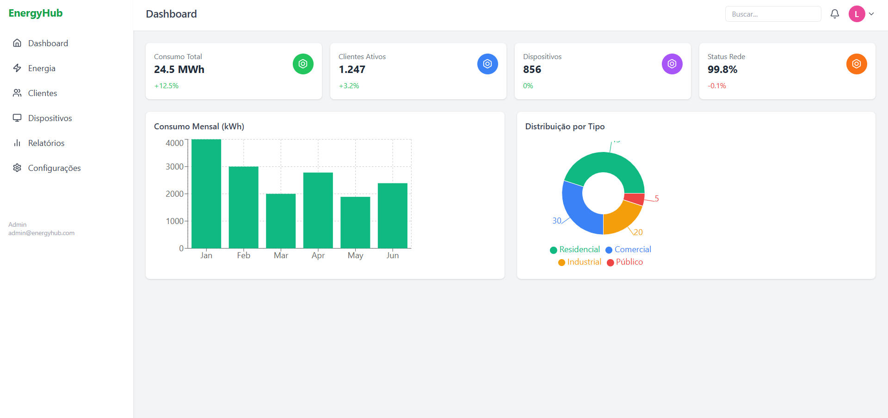

⚡ Elektos - EnergyHub
Este é o projeto desenvolvido como teste técnico para a vaga de Desenvolvedor(a) Frontend na Flori Tech (Elektos). A proposta consiste na criação de um dashboard responsivo e funcional utilizando React e Tailwind CSS, com dados mockados e elementos interativos.

🚀 Tecnologias Utilizadas
React

Vite

Tailwind CSS

Lucide Icons

Recharts — para gráficos interativos

🧱 Estrutura do Projeto
Sidebar: Menu lateral com navegação, visível em telas maiores e acessível via botão em telas menores.

Navbar: Cabeçalho com botão de menu responsivo, campo de busca e perfil de usuário.

Widgets: Cards com métricas principais (Consumo Total, Clientes Ativos, Dispositivos, Status da Rede) com efeito hover animado.

ChartSection:

Gráfico de Barras: Consumo mensal.

Gráfico de Pizza: Distribuição por tipo de consumo, com tooltip interativo.

Responsividade: Adaptado para dispositivos móveis, tablets e desktops.

✅ Funcionalidades
Interface clara e moderna

Design mobile-first

Animações em hover nos cards

Menu lateral com transição fluida no mobile

Gráficos interativos com tooltip de valor e legenda

🧠 Conclusão
Esse projeto foi uma excelente oportunidade para colocar em prática meus conhecimentos em React, Tailwind CSS e componentização de interfaces modernas. Consegui desenvolver um dashboard limpo, funcional, visualmente agradável e com uma boa experiência para o usuário, mesmo em telas menores.

Estou muito motivada com essa possibilidade de integrar a equipe da Flori Tech, pois acredito no propósito do projeto e estou disposta a contribuir com dedicação, aprendizado constante e criatividade.

Agradeço a oportunidade de mostrar meu trabalho por meio deste teste prático. Espero que gostem da minha entrega! 💙

